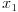
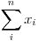
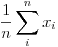

# Notação - *Notation*
Notação é utilizada para comunicar ideias matemáticas de forma mais clara e simples do que por palavras. Sendo como uma linguagem universal usada por acadêmicos e profissionais da indústria para transmitir ideias matemáticas. 

# Linha e Coluna
Uma variável aleatória pode corresponde em uma planilha uma das colunas, representando um aspecto do conjunto de dados. 

Por exemplo:

| Data        | Dia da Semana | Tempo gasto no site (`X`) | Compra (`Y`)  |
| ---         | ---           | ---                       | ---           |
| Junho 15    | Quinta-feira  | 5                         | Não           |
| Junho 15    | Quinta-feira  | 10                        | Sim           |
| Junho 16    | Sexta-feira   | 20                        | Sim           |
| Junho 17    | Sábado        | 45                        | Sim           |

Uma variável aleatória representa uma coluna da planilha, como no exemplo anterior, `X` representa a coluna `Tempo gasto no site`, ao passo que `Y` a coluna `Compra`.

Então, no universo analisado uma variável aleatória representa um espaço reservado para os possíveis valores da sua representação. Por exemplo, em `Tempo gasto no site`, `X` corresponde a coleção de dados `5, 10, 20`.

Ao observar um resultado dos valores da variável aleatória utilizamos a mesma letra, porém minúscula e sua posição no seu universo. 

Por exemplo: O segundo registro, `10` é representado por **x2**, onde `x` é a letra da variável representada em minúscula para indicar que é um registro (instância) e o `2` representa a sua sequência.

Com o uso de notação podemos representar por exemplo, funções mais complexas como probabilidade. Sendo **P(X > 20)**, onde **P** representa **Probabilidade** e a expressão entre parenteses a condição, que um registro de **X** seja maior que **20**. 

No conjunto de dados citado anteriormente, **P(X > 20)** é a notação para: **Qual é a probabilidade de um usuário gastar mais de 20 minutos no site?**.

No universo de `5, 10, 20, 45`, **P(X > 20)** apresenta a probabilidade de **25%**.

# Resumo

| Notação | Descrição | Exemplo |
| ---     | ---       | ---     |
| X       | Uma variável aleatória  | Tempo gasto no site |
|   | Primeiro valor observado da variável aleatória `X`  | 5 |
|   | Somatório dos valores começando na primeira observação e terminando na última  | 5 + ... + 45 = 80 |
|   | Somatório dos valores começando na primeira observação e terminando na última e divida pelo número de observações (média) | (5 + ... + 45) / 4 = 20 |
|   | Simplificação da notação anterior - a média | (5 + ... + 45) / 4 = 20 |

>   *Notações geradas em: [sciweavers.org](http://www.sciweavers.org/free-online-latex-equation-editor)*