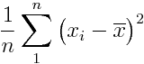
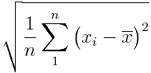

# Dispersão - *Spread*
# Resumo em 5 números (5 number summary)
* Mínimo
* Quartil 1 (Q1) - Mediana [Mín : < Q2]
* Quartil 2 (Q2) - Mediana
* Quartil 3 (Q3) - Mediana [Q2 > : Máx ]
* Máximo

**Amplitude:** Diferença entre `Máximo` e `Mínimo`

**Amplitude Interquartil:** Diferença entre `Q3` e `Q1`

Para conjuntos de dados **assimétricos**, o resumo de cinco números e um box-plot correspondente são ótimos para compreender a dispersão dos dados, o que também é possível com histogramas.

# Variância e desvio padrão
## Variância

A variância é a **média da diferença ao quadrado de cada observação da média**.

## Desvio padrão
O desvio padrão é a raiz quadrada da variância. 

O **desvio padrão** está na mesma unidade do restante dos dados, ao passo que as unidades da **variância** são o quadrado dos dados originais.

